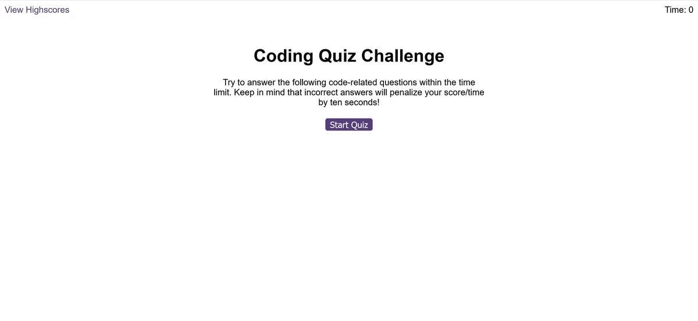

# Quiz-and-Score

# Description
The task is to build a timed coding quiz with multiple-choice questions. The app will run in the browser, and will feature dynamically updated HTML and CSS powered by JavaScript code. The app has a responsive user interface, the questions are displayed one at a time and they have single choice answer. The feadback for each answer is displayed at the bottom of the page and an audio sound is played, different one for a wrong and a correc tanswer. At the end of the quiz, the user is asked to enter the initials and a scoreboard is displayed with the score history of each user.

# Preview

# Links
<ul>
  <li>GitHub Repository: https://github.com/valimanea/Quiz-and-Score</li>
  <li>Deployed application: https://valimanea.github.io/Quiz-and-Score/index.html</li>
</ul>

